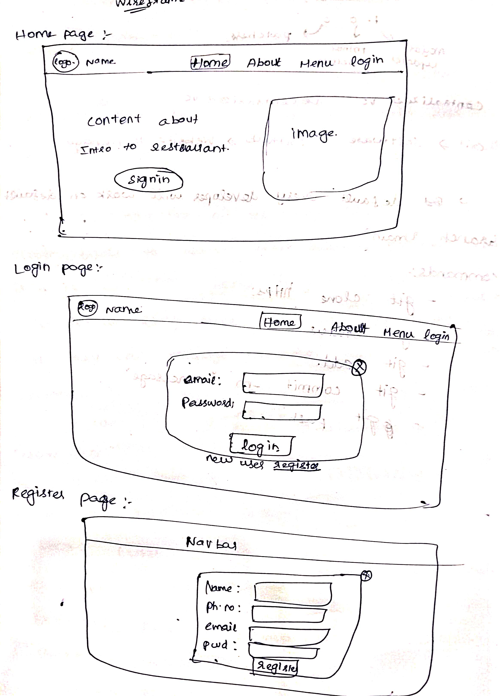
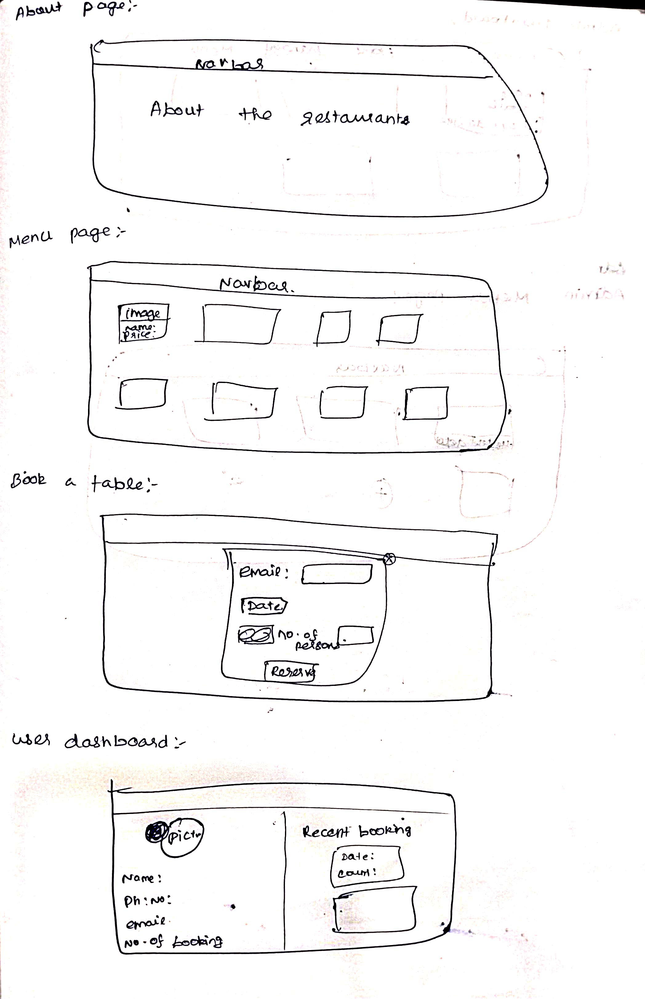
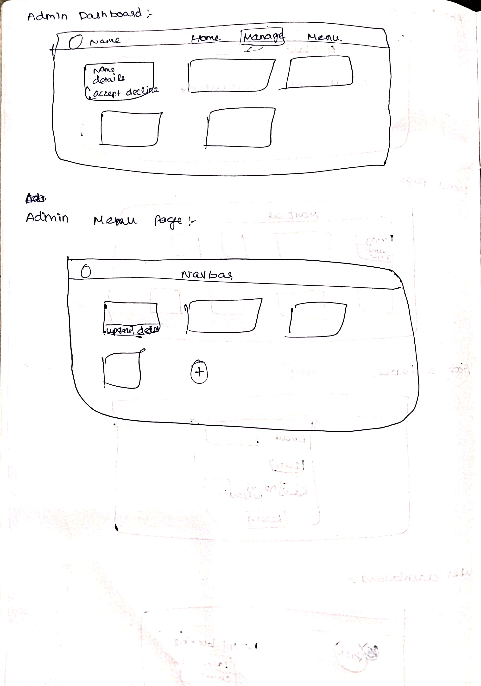

# Restaurant Reservation System

## Overview

The **Restaurant Reservation System** is a web application that allows customers to book tables at a restaurant, view available time slots, and receive booking confirmations. It also provides an admin dashboard for restaurant staff to manage reservations, modify availability, and track booking trends. The system includes user authentication, real-time availability updates, and email/SMS notifications for both customers and admins.

## Objective

- **For Customers**:
  - Make reservations based on available time slots.
  - Receive confirmation emails/SMS after booking.
  - View and manage personal reservations.
  
- **For Admins**:
  - View and manage customer reservations.
  - Modify table availability (based on events, holidays, etc.).
  - Send email/SMS notifications to customers.
  - View reservation reports and analytics for better planning.

## Tech Stack

- **Frontend**:  
  - React.js (for building the user interface)
  - Tailwind CSS (for styling and responsive design)
  - Axios (for making HTTP requests to the backend)

- **Backend**:  
  - Node.js (server-side runtime environment)
  - Express.js (web framework for handling HTTP requests)

- **Database**:  
  - MySQL (for storing reservation data, user profiles, and admin actions)

## Workflow

1. **Customer Booking Process**:
   - Customers select a date, time, and number of people.
   - The system shows available time slots and confirms availability.
   - After selecting a slot, customers enter their details and complete the reservation.
   - The customer receives an email/SMS confirmation.

1. **Admin Management**:
   - Admins log in to the dashboard and view all active reservations.
   - They can modify, cancel, or reschedule reservations.
   - Admins can also adjust table availability for special events or holidays.

1. **Notifications**:
   - Customers receive email/SMS confirmations upon booking and reminders before the reservation time.
   - Admins can send custom notifications for any necessary updates.

## Roles

- **Customer**: Can create reservations, manage personal profiles, and receive notifications.
- **Admin**: Manages reservation data, modifies availability, and sends notifications to customers.

## Layout 

